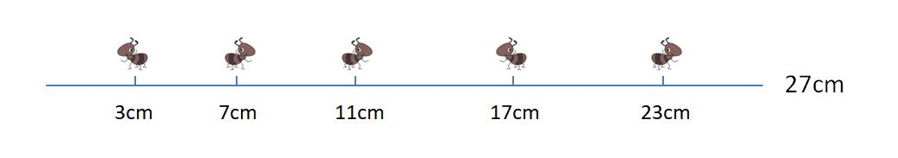
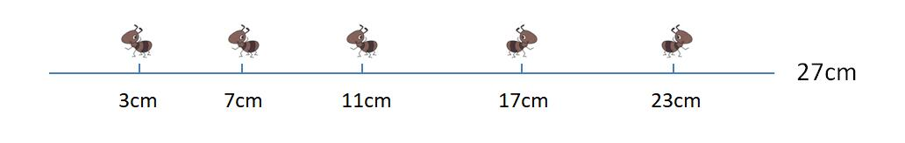
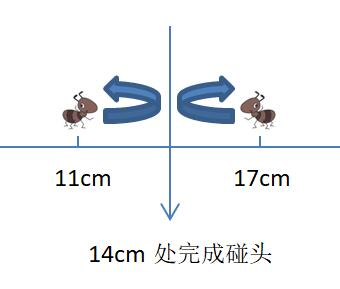
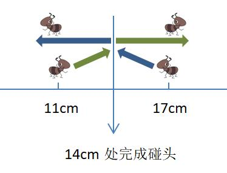

## [《算法设计与分析》](#welcome)核心讲解📚

    . .  

&emsp;&emsp;**【说明】** ：在我的另一个 repository 下，专门做了 Python 的数据结构与算法介绍，详情请戳 [这个网址](https://github.com/fmw666/Python/tree/master/step3-Algorithm)，这个 repo 下会基于 Python 语言实现大部分数据结构和算法，而现在这个 repo 存在的意义在于更多的对数据结构和算法进行一个基础性的介绍，所以会着重用 C、C++ 等语言去描述。

    . .  

&emsp;&emsp;⭐ 整篇文章只讲干货，谨代表内容十分重要，以及需要重点去理解。

    .  

    <a href="#-目录">跳到目录 ⬇</a>

---

&emsp;&emsp;*“通俗来讲，算法是指解决问题的一种方法或一个过程。更严格来讲，算法是由若干条指令组成的有穷序列。”*

&emsp;&emsp;*“算法满足 4 条性质： &emsp;&emsp; ① 输入：有零个或多个由外部提供的量作为算法的输入。 &emsp;&emsp; ② 输出：算法产生至少一个量作为输出。 &emsp;&emsp; ③ 确定性：组成算法的每条指令是清晰的，无歧义的。 &emsp;&emsp; ④ 有限性：算法中每条指令的执行次数是有限的，执行每条指令的时间也是有限的。 &emsp;&emsp;”*

&emsp;&emsp;*“算法评价的四个方面：正确性、可读性、健壮性和可移植性。”*

---

+ ### 💡 [12个小球，有一个轻重不一样，给你一个天平允许称3次，找出那个问题球，说明轻重。](#question)

    + 首先方法很多，我这里提供的方法仅代表其中一种思想。

    + **第一步：** 把 12 个小球任意打乱分为三组并依次标号，即 1 组：1号，2号，3号，4号；2 组：5号，6号，7号，8号；3 组：9号，10号，11号，12号。

    + **第二步：** 在三个组中任取两组进行[第一次比较](#case1)。如 1 组 1-4号和 2 组 5-8号比较。

        + **[情况 1：](#case1)** 重量相等，则第 3 组中有问题，1 组和 2 组八个球均正常。

            + **第三步：** 取第 3 组四个小球中任意三个球与 1、2 组中八个正常球中任意三个小球进行[第二次比较](#case1)。如 1 组 1-3号和 3 组 9-11号比较。

                + **[情况 1-1：](#case1-1)** 重量相等，则第 3 组中剩下的 12号球有问题，其余球均为正常球。

                    + **第四步：** 将 12号球与任意一个正常球进行[第三次比较](#case1)。

                        + **[情况 1-1-1：](#case1-1-1)** 12号球更重，则 12号球为问题球，且比正常球更重。（情况 1-1-1 完）

                        + **[情况 1-1-2：](#case1-1-2)** 12号球更轻，则 12号球为问题球，且比正常球更轻。（情况 1-1-2 完）

                + **[情况 1-2：](#case1-2)** 重量不相等，且 9-11号球偏重，则第 3 组中，问题球（重球）出在 9、10 或 11号中。

                    + **第四步：** 在问题球中任选两个球进行[第三次比较](#case1)，如 9号和 10号。

                        + **[情况 1-2-1：](#case1-2-1)** 重量相等，则问题球为 11 号，且比正常球更重。（情况 1-2-1 完）

                        + **[情况 1-2-2：](#case1-2-2)** 重量不相等，且 9号球更重，则问题球为 9号，且比正常球更重。（情况 1-2-2 完）

                        + **[情况 1-2-3：](#case1-2-3)** 重量不相等，且 10号球更重，则问题球为 10号，且比正常球更重。（情况 1-2-3 完）

                + **[情况 1-3：](#case1-3)** 重量不相等，且 9-11号球偏轻，则第 3 组中，问题球（轻球）出在 9、10 或 11号中（同情况 1-2）。

                    + **第四步：** 在问题球中任选两个球进行[第三次比较](#case1)，如 9号和 10号。

                        + **[情况 1-3-1：](#case1-3-1)** 重量相等，则问题球为 11号，且比正常球更轻。（情况 1-3-1 完）

                        + **[情况 1-3-2：](#case1-3-2)** 重量不相等，且 9号球更轻，则问题球为 9号，且比正常球更轻。（情况 1-3-2 完）

                        + **[情况 1-3-3：](#case1-3-3)** 重量不相等，且 10号球更轻，则问题球为 10号，且比正常球更轻。（情况 1-3-3 完）
                
        + **[情况 2：](#case2)** 重量不相等，则第 1 组或第 2 组中八个球其中之一有问题，3 组四个球均正常。

            + **第三步：** 假设第 1 组（1-4号）比第 2 组（5-8号）更重，后面就不再考虑第 1 组比第 2 组更轻的情况了，因为和这里讨论的情况完全一致。

            + **第四步：** 在第 1 组中任取一个小球，第 2 组中任取三个小球组成一组。在第 2 组中取剩余的最后一个小球与第 3 组中任意三个正常小球组成一组。如 a 组：1号，5号，6号，7号；b 组：8号，9号，10号，11号。

            * **第五步：** 将上一步中 a、b 组做[第二次比较](#case1)。

                + **[情况 2-1：](#case2-1)** 重量相等，则问题球（重球）出在第 1 组剩余的三个小球 2-4号中。

                    + **第六步：** 在这三个小球中任取两个小球进行[第三次比较](#case1)，如 2号和 3号。

                        + **[情况 2-1-1：](#case2-1-1)** 重量相等，则问题球为 4号，且比正常球更重。（情况 2-1-1 完）

                        + **[情况 2-1-2：](#case2-1-2)** 重量不相等，则重的那个球有问题，且比正常球更重。（情况 2-1-2 完）

                + **[情况 2-2：](#case2-2)** 重量不相等，且 a 组更重，则只可能是 a 组中 1号重了，或者 b 组中 8号轻了。

                    + **第六步：** 任取一个正常球和 1号或者 8号做[第三次比较](#case1)，如 1号和正常球 9号。

                        + **[情况 2-2-1：](#case2-2-1)** 重量相等，则问题球为 8号，且比正常球更轻。（情况 2-2-1 完）

                        + **[情况 2-2-2：](#case2-2-2)** 重量不相等，则问题球为 1号，且比正常球更重。（情况 2-2-2 完）

                + **[情况 2-3：](#case2-2)** 重量不相等，且 b 组更重，则只可能是 a 组中 5、6、7号三个球某一个球轻了。

                    + **第六步：** 任取 5、6、7号三个球中任意两个球做[第三次比较](#case1)，如 5号和 6号。

                        + **[情况 2-3-1：](#case2-3-1)** 重量相等，则问题球为 7号，且比正常球更轻。（情况 2-3-1 完）

                        + **[情况 2-3-2：](#case2-3-2)** 重量不相等，则轻的那个球有问题，且比正常球更轻。（情况 2-3-2 完）

    + **【特别强调】：** 上述步骤未列出所有可能发生情况，仅在这儿提供一个解题思路和方法。当然基于上述思想可以列出所有情况，并且可以通过程序算法实现。

+ ### 💡 [有一根27厘米长的细木杆，在第3厘米，7厘米，11厘米，17厘米，23厘米这五个位置上各有一只蚂蚁，木杆很细，不能同时通过两只蚂蚁。开始时，蚂蚁的头朝向左还是右是任意的，他们只会朝前走或掉头，但不会后退，当两只蚂蚁相遇后，蚂蚁会同时掉头朝反方向走，假设蚂蚁们每秒钟可以走1厘米的距离。求所有蚂蚁都离开木杆的最小时间和最大时间。](#question)

    

        
    

    + 这道题如果你按照题目意思，即蚂蚁碰头即掉头的思想然后去寻觅每只蚂蚁的行动轨迹，那可能真有点复杂了。（有兴趣的同学当然可以去试试，我不反对任何求知与探索过程）

    + 木杆长 27 cm，所以中间结点位置为 13.5 cm。（即 11 cm 处蚂蚁更靠近木杆左方，17 cm 处蚂蚁更靠近木杆右方）

    + **最小时间：** 当在中间结点左边的蚂蚁全部初始就向左开始走、在中间结点右边的蚂蚁全部初始就向右开始走，得到的一定为最短时间。（当然最短时间不一定只出在这种情况下，但是这种情况下一定是最短时间）

        + 如下图初始蚂蚁头朝向情况所示：
        

            
        

        + 所以最小距离为第 11 cm 处蚂蚁往左行走到木杆尽头的长度 11 cm。即最小时间为：**[11 s](#answer)**

    + **最大时间：** 这儿要提出一个等价思想。在这道题中，如果只对单个蚂蚁做运动轨迹推算，那么很难理清楚所有情况，所以我们先考虑当两只蚂蚁碰头会是什么情况。

        + 当两只蚂蚁碰头后，则它们会掉头继续前进。如下图所示：
        

            
        

        + 这儿要充分利用等价思想，不要考虑单个蚂蚁的运动轨迹，我们只考虑整体的情况。左边蚂蚁与右边蚂蚁碰头后，左、右蚂蚁同时转向，如果只考虑整体的运动轨迹，那么我们等价转向后的蚂蚁运动是与它碰头那只蚂蚁的下一步动作。如下图所示：
        

            
        

        + 所以最大距离为第 3 cm 处蚂蚁往右行走到木杆尽头的长度 24 cm。即最大时间为：**[24 s](#answer)**

---

ok，我想放首页的就这两道题。下面肯定很多人会问，这儿也没写程序啊，也没用到什么算法啊？（无奈脸 QAQ）

+ **首先第一题，告诉我们考虑问题时每一步、每种情况一定要考虑清楚，这和我们写算法、写程序是一样的。我希望大家能有这样共识，程序员写代码，一定要考虑到实际问题和程序执行过程中的所有情况。**

+ **然后第二题，我只想说明两个字，“思想”。后续算法学习中，我们会遇到更多的、不同类型的题目，有些题你无从下手，甚至有些题的题目都很难去理解。所以，一个合理的解决问题的思想永远是解决问题的先驱条件，有些时候甚至穷举也是一种极为合理的思想。**

    . .  

> 最后我会把目录放在尾部，为什么不放在最前面？就是因为我想让你们在查阅目录时，时刻都能看到上面这两道题，以此来唤醒你们对算法学习前的正确认知！

    . .  

    <a href="#算法设计与分析核心讲解">返回顶部 ⬆</a>

## 🎈 目录

+ #### [算法基础练习](docs/算法基础练习.md)

+ #### [分治法](docs/分治法.md)

+ #### [动态规划法](docs/动态规划法.md)

+ #### [贪心算法](docs/贪心算法.md)

+ #### [回溯法](docs/回溯法.md)

+ #### [分支限界法](docs/分支限界法.md)

+ #### [线性规划](docs/线性规划.md)

      
    --end--

