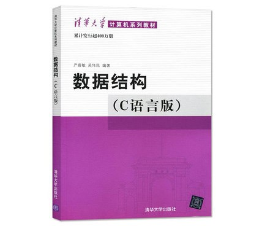

## [《数据结构》](#welcome)知识点深度讲解📚

 

> *一切为了 **技术** 和 **考研** 而努力！*

 

    

 

&emsp;&emsp;💡 教材选自 《数据结构》（C语言版） 严蔚敏 主编. 清华大学出版社, 2017. 

 

    

### 📝 知识点目录

>> 温馨提示：① 部分知识点顺序未参考书本目录顺序，教材只做参考；② 大部分内容会以 Python 作为第二语言描述与实现。

+ [**第一节--绪论**](#)
    
  - [P71-4.2节 原码一位乘](#)
  
+ [**第二节--线性表**](#)

+ [**第三节--栈和队列**](#)

+ [**第四节--字符串**](#)

+ [**第五节--数组和广义表**](#)

+ [**第六节--树和二叉树**](#)

+ [**第七节--图**](#)

+ [**第八节--动态存储管理**](#)

+ [**第九节--查找**](#)

+ [**第十节--排序**](#)

+ [**第十一节--文件**](#)

 

    
    <h2>第一节 -- 绪论</h2>

    <a href="#-知识点目录">返回目录⬆</a>

### 原码一位乘
